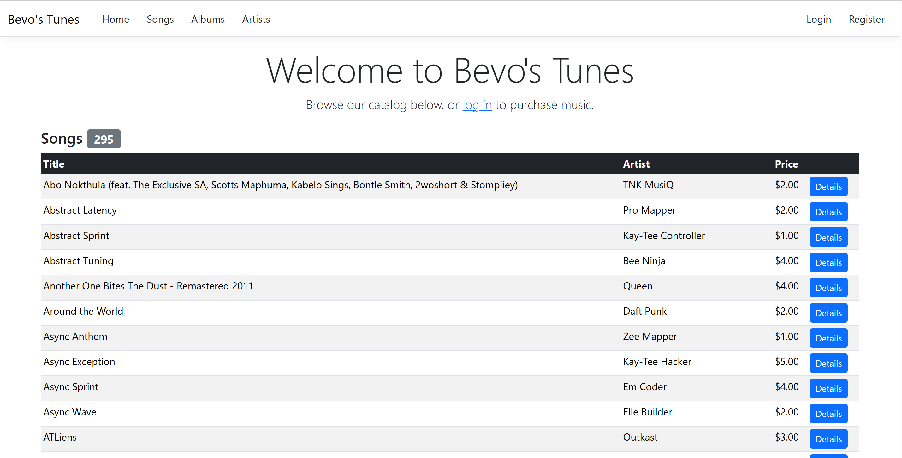

# Bevo's Tunes

A role-based music storefront built with ASP.NET Core MVC. Customers browse, buy, gift, and review songs and albums. Employees and managers get back-office tools for customer support, catalog management, promotions, and sales reporting.



## Features

**Customers**
- Browse and search songs, albums, and artists (by keyword, genre, and rating) without logging in
- Keep a persistent cart that flags songs you'd be buying twice through an album
- Check out with a saved or new card, for yourself or as a gift to another customer
- Get itemized order, gift, and refund emails
- View order history, a gift-aware *My Music* library, and a *My Reviews* page

**Employees**
- Create, edit, disable, and re-enable customer accounts
- Approve, reject, and edit reviews
- Place orders on a customer's behalf

**Managers**
- Everything employees can do, plus hire, edit, fire, rehire, and promote employees
- Manage songs, albums, artists, genres, featured items, and discounts
- View sales reports for songs, albums, and top bands by genre

## Tech stack

- ASP.NET Core MVC on .NET 10, Razor views, Bootstrap 5
- Entity Framework Core + SQL Server
- Gmail SMTP for transactional email; [Zippopotam](https://zippopotam.us) for ZIP → city/state lookup
- No custom JavaScript or front-end framework. MIS 333K is a server-side C#/MVC course, so every interaction is a server-rendered page or form post.

## Getting started

**Prerequisites:** [.NET 10 SDK](https://dotnet.microsoft.com/download) and an empty SQL Server database (LocalDB, SQL Server Express, or Azure SQL all work).

1. Clone the repo.
2. Copy `BevosTunesMVC/appsettings.Development.json.example` to `BevosTunesMVC/appsettings.Development.json`. This file is gitignored.
3. Set `ConnectionStrings:DefaultConnection` to your database. For LocalDB, use:
   ```
   Server=(localdb)\\MSSQLLocalDB;Database=BevosTunes;Trusted_Connection=True;TrustServerCertificate=True;
   ```
4. Optional: fill in the `Email` section with a Gmail address and [app password](https://support.google.com/accounts/answer/185833) to send real emails.
5. Run:
   ```bash
   dotnet run --project BevosTunesMVC/BevosTunesMVC.csproj
   ```
6. Open `http://localhost:5150`.

On first run, the app applies migrations and seeds a full demo dataset: catalog, customers, staff, orders, reviews, discounts, and featured items. Seeding only runs when the database is empty, so to reset, point the app at a fresh database and run it again.

### Demo accounts

| Role | Email | Password |
|---|---|---|
| Customer | `cbaker@example.com` | `musiclover` |
| Customer | `banker@longhorn.net` | `potato` |
| Employee | `j.smith@bevotunes.com` | `Password1` |
| Manager | `c.baker@bevotunes.com` | `dewey4` |

Seeded customer emails are placeholders. To test email delivery, register a new account with an inbox you control.

## Configuration

Local settings go in `appsettings.Development.json`. For hosted environments, use environment variables. ASP.NET maps `__` to `:`.

| Setting | Purpose |
|---|---|
| `ConnectionStrings__DefaultConnection` | SQL Server connection string (required) |
| `Email__SmtpHost`, `Email__SmtpPort` | SMTP server (defaults to Gmail on 587) |
| `Email__FromAddress`, `Email__AppPassword` | SMTP sender account |
| `Email__SubjectPrefix` | Prefix for email subject lines |
| `Email__GradingInbox` | Optional address BCC'd on purchase and refund emails |

## Project structure

```
BevosTunesMVC/          ASP.NET Core MVC app
  Controllers/          Request handling by role and feature
  Models/               EF Core entities and view models
  DAL/                  DbContext and generated seed data
  Services/             Email delivery
  Views/                Razor views
  Migrations/           EF Core schema history
tools/seeder/           Python generator that turns the seed spreadsheet into DAL/DbSeeder.cs
.github/workflows/      Build CI and a manual Azure deploy workflow
```

`DAL/DbSeeder.cs` is generated from `tools/seeder/BevosTunes_Data.xlsx`, so don't edit it by hand. To change the seed data, edit the spreadsheet, then run:

```bash
pip install openpyxl
python tools/seeder/gen_seeder.py
```

The new data loads the next time the app starts against an empty database.

## Deployment

The original Azure App Service and Azure SQL instance have been retired. Pushes to `main` run a build-only CI check. The Azure deploy workflow is kept as a manual action (`Manual Azure deploy - BevosTunes`). To use it, create an App Service, add an `AZURE_WEBAPP_PUBLISH_PROFILE` repository secret, and run the workflow with your app name.

## Acknowledgements

Bevo's Tunes was built by Group 7 as the final project for MIS 333K at the University of Texas at Austin in Spring 2026. The course provided the requirements and seed data. The project was graded live against 200 spec test cases, passed 96% of them, and placed first among all MIS 333K teams that semester, which came with a $2,000 prize. Special thanks to Professor Jawad and the MIS 333K TAs for their help throughout the semester.

**Group 7:** Aviral Agarwal, Samhith Dharani, Shriya Punreddy, Raya Bhattacharyya

## License

[MIT](LICENSE)
